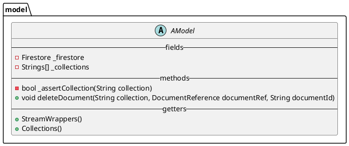

```plantuml
@startuml Model

package model {
    abstract class AModel {
        --fields--
        - Firestore _firestore
        - Strings[] _collections
        -- methods --
        - bool _assertCollection(String collection)
        + void deleteDocument(String collection, DocumentReference documentRef, String documentId)
        -- getters --
        + StreamWrappers()
        + Collections()
    }
}

@enduml
```