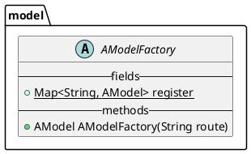

```plantuml
@startuml AModelFactory

package model {
    abstract class AModelFactory {
        --fields--
        + {static} Map<String, AModel> register
        -- methods --
        + AModel AModelFactory(String route)
    }
}

@enduml
```