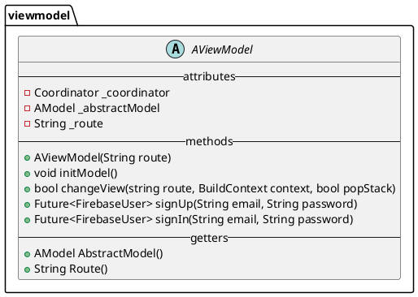

```plantuml
@startuml ViewModel

package viewmodel {
    abstract class   AViewModel {
        -- attributes --
        - Coordinator _coordinator
        - AModel _abstractModel
        - String _route
        -- methods --
        + AViewModel(String route)
        + void initModel()
        + bool changeView(string route, BuildContext context, bool popStack)
        + Future<FirebaseUser> signUp(String email, String password)
        + Future<FirebaseUser> signIn(String email, String password)
        -- getters --
        + AModel AbstractModel()
        + String Route()
    }
}

@enduml
```