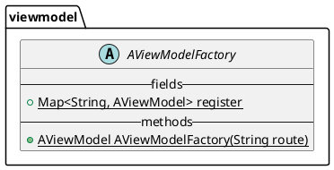

```plantuml
@startuml AViewModelFactory

package viewmodel {
    abstract class AViewModelFactory {
        -- fields --
        + {static} Map<String, AViewModel> register
        -- methods --
        + {static} AViewModel AViewModelFactory(String route)
    }
}

@enduml
```