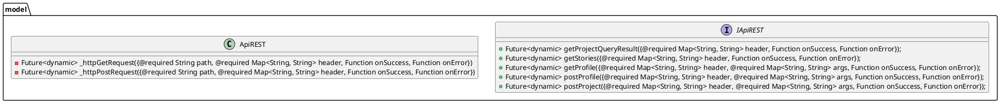

```plantuml
@startuml Model

package model {
    
    interface IApiREST {
         + Future<dynamic> getProjectQueryResult({@required Map<String, String> header, Function onSuccess, Function onError});
         + Future<dynamic> getStories({@required Map<String, String> header, Function onSuccess, Function onError});
         + Future<dynamic> getProfile({@required Map<String, String> header, @required Map<String, String> args, Function onSuccess, Function onError});
         + Future<dynamic> postProfile({@required Map<String, String> header, @required Map<String, String> args, Function onSuccess, Function onError});
         + Future<dynamic> postProject({@required Map<String, String> header, @required Map<String, String> args, Function onSuccess, Function onError});
    }
    
    class ApiREST {
       - Future<dynamic> _httpGetRequest({@required String path, @required Map<String, String> header, Function onSuccess, Function onError})
       - Future<dynamic> _httpPostRequest({@required String path, @required Map<String, String> header, Function onSuccess, Function onError})
    }
}

@enduml
```