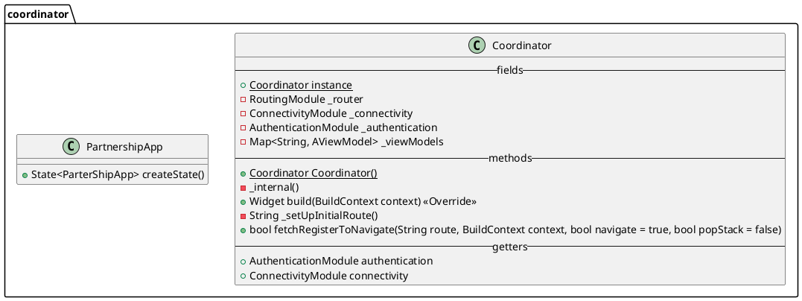

```plantuml
@startuml AppCoordinator

package coordinator {
    class Coordinator {
        --fields--
        + {static} Coordinator instance
        - RoutingModule _router
        - ConnectivityModule _connectivity
        - AuthenticationModule _authentication
        - Map<String, AViewModel> _viewModels
        --methods--
        + {static} Coordinator Coordinator()
        - _internal()
        + Widget build(BuildContext context) <<Override>>
        - String _setUpInitialRoute()
        + bool fetchRegisterToNavigate(String route, BuildContext context, bool navigate = true, bool popStack = false)
        --getters--
        + AuthenticationModule authentication
        + ConnectivityModule connectivity
    }
    class PartnershipApp {
        + State<ParterShipApp> createState()
    }
}

@enduml
```