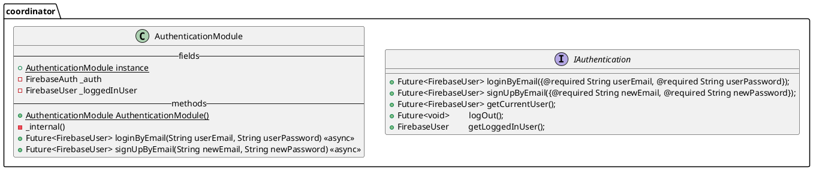

```plantuml
@startuml AuthenticationModule

package coordinator {

    interface IAuthentication {
         + Future<FirebaseUser> loginByEmail({@required String userEmail, @required String userPassword});
         + Future<FirebaseUser> signUpByEmail({@required String newEmail, @required String newPassword});
         + Future<FirebaseUser> getCurrentUser();
         + Future<void>         logOut();
         + FirebaseUser         getLoggedInUser();
    }
    class   AuthenticationModule {
        --fields--
        + {static} AuthenticationModule instance
        - FirebaseAuth _auth
        - FirebaseUser _loggedInUser
        --methods--
        + {static} AuthenticationModule AuthenticationModule()
        - _internal()
        + Future<FirebaseUser> loginByEmail(String userEmail, String userPassword) <<async>>
        + Future<FirebaseUser> signUpByEmail(String newEmail, String newPassword) <<async>>
    }
}

@enduml
```