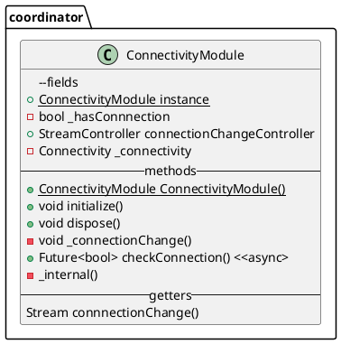

```plantuml
@startuml ConnectivityModule

package coordinator {
    class   ConnectivityModule {
        --fields
        {static} + ConnectivityModule instance
        - bool _hasConnnection
        + StreamController connectionChangeController
        - Connectivity _connectivity
        --methods--
        {static} + ConnectivityModule ConnectivityModule()
        + void initialize()
        + void dispose()
        - void _connectionChange()
        + Future<bool> checkConnection() <<async>
        - _internal()
        --getters--
        Stream connnectionChange()
    }
}

@enduml
```