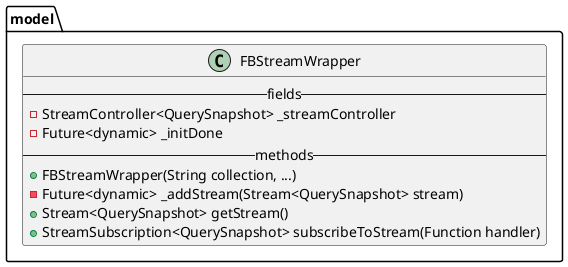

```plantuml
@startuml FBStreamWrapper

package model {
    class FBStreamWrapper {
        -- fields --
        - StreamController<QuerySnapshot> _streamController
        - Future<dynamic> _initDone
        -- methods --
        + FBStreamWrapper(String collection, ...)
        - Future<dynamic> _addStream(Stream<QuerySnapshot> stream)
        + Stream<QuerySnapshot> getStream()
        + StreamSubscription<QuerySnapshot> subscribeToStream(Function handler)
    }
}

@enduml
```

