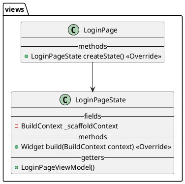

```plantuml
@startuml LoginPage

package views {
    class   LoginPage {
        -- methods --
        + LoginPageState createState() <<Override>>
    }
    class   LoginPageState {
        -- fields --
        - BuildContext _scaffoldContext
        -- methods --
        + Widget build(BuildContext context) <<Override>>
        -- getters --
        + LoginPageViewModel()
    }
}

LoginPage --> LoginPageState

@enduml
```