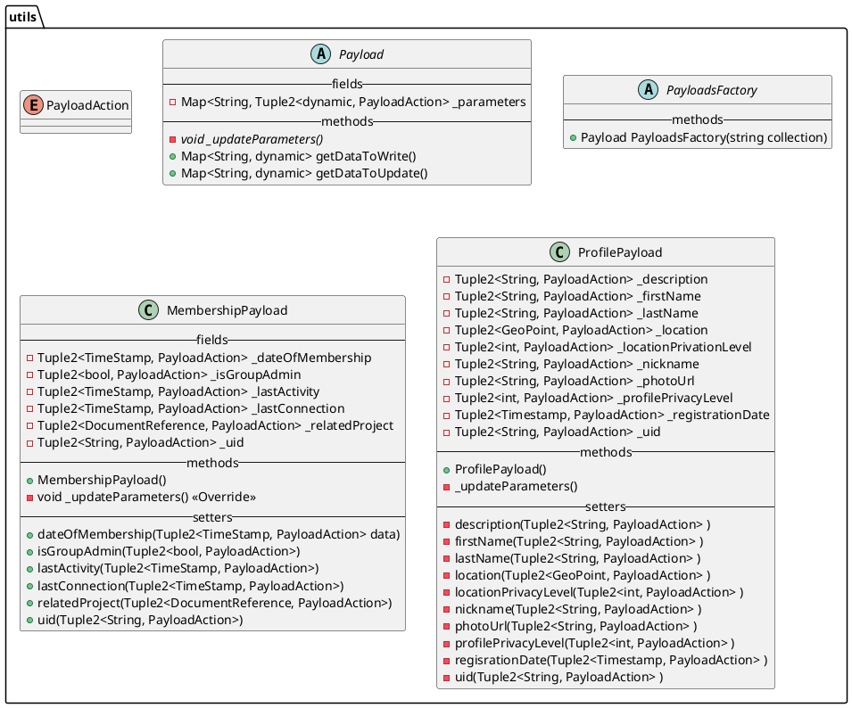

```plantuml
@startuml PayloadsFactory

package utils {
    enum PayloadAction {
    }
    abstract class Payload {
        --fields--
        - Map<String, Tuple2<dynamic, PayloadAction> _parameters
        --methods--
        - {abstract} void _updateParameters()
        + Map<String, dynamic> getDataToWrite()
        + Map<String, dynamic> getDataToUpdate()
    }
    abstract class PayloadsFactory {
        --methods--
        + Payload PayloadsFactory(string collection)
    }
    class MembershipPayload {
        --fields--
        - Tuple2<TimeStamp, PayloadAction> _dateOfMembership
        - Tuple2<bool, PayloadAction> _isGroupAdmin
        - Tuple2<TimeStamp, PayloadAction> _lastActivity
        - Tuple2<TimeStamp, PayloadAction> _lastConnection
        - Tuple2<DocumentReference, PayloadAction> _relatedProject
        - Tuple2<String, PayloadAction> _uid
        --methods--
        + MembershipPayload()
        - void _updateParameters() <<Override>>
        --setters--
        + dateOfMembership(Tuple2<TimeStamp, PayloadAction> data)
        + isGroupAdmin(Tuple2<bool, PayloadAction>)
        + lastActivity(Tuple2<TimeStamp, PayloadAction>)
        + lastConnection(Tuple2<TimeStamp, PayloadAction>)
        + relatedProject(Tuple2<DocumentReference, PayloadAction>)
        + uid(Tuple2<String, PayloadAction>)
    }
    class ProfilePayload {
        - Tuple2<String, PayloadAction> _description
        - Tuple2<String, PayloadAction> _firstName
        - Tuple2<String, PayloadAction> _lastName
        - Tuple2<GeoPoint, PayloadAction> _location
        - Tuple2<int, PayloadAction> _locationPrivationLevel
        - Tuple2<String, PayloadAction> _nickname
        - Tuple2<String, PayloadAction> _photoUrl
        - Tuple2<int, PayloadAction> _profilePrivacyLevel
        - Tuple2<Timestamp, PayloadAction> _registrationDate
        - Tuple2<String, PayloadAction> _uid
        --methods--
        + ProfilePayload()
        - _updateParameters()
        --setters--
        - description(Tuple2<String, PayloadAction> )
        - firstName(Tuple2<String, PayloadAction> )
        - lastName(Tuple2<String, PayloadAction> )
        - location(Tuple2<GeoPoint, PayloadAction> )
        - locationPrivacyLevel(Tuple2<int, PayloadAction> )
        - nickname(Tuple2<String, PayloadAction> )
        - photoUrl(Tuple2<String, PayloadAction> )
        - profilePrivacyLevel(Tuple2<int, PayloadAction> )
        - regisrationDate(Tuple2<Timestamp, PayloadAction> )
        - uid(Tuple2<String, PayloadAction> )
    }
}

@enduml
```