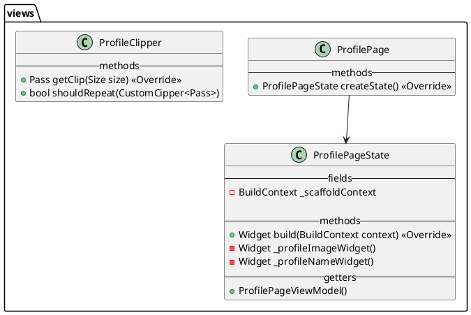

```plantuml
@startuml ProfilePage

package views {
    class   ProfilePage {
        -- methods --
        + ProfilePageState createState() <<Override>>
    }
    class   ProfilePageState {
        -- fields --
        - BuildContext _scaffoldContext
        
        -- methods --
        + Widget build(BuildContext context) <<Override>>
        - Widget _profileImageWidget()
        - Widget _profileNameWidget()
        -- getters --
        + ProfilePageViewModel()
    }
    class   ProfileClipper {
        -- methods --
        + Pass getClip(Size size) <<Override>>
        + bool shouldRepeat(CustomCipper<Pass>)
    }
}

ProfilePage --> ProfilePageState

@enduml
```