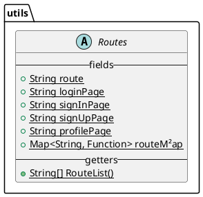

```plantuml
@startuml Routes

package utils {
    abstract class Routes {
        -- fields --
        + {static} String route
        + {static} String loginPage
        + {static} String signInPage
        + {static} String signUpPage
        + {static} String profilePage
        + {static} Map<String, Function> routeM²ap
        -- getters --
        + {static} String[] RouteList()
    }
}

@enduml
```