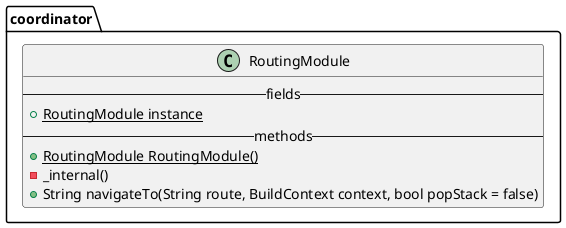

```plantuml
@startuml RoutingModule

package coordinator {
    class RoutingModule {
        --fields--
        {static} + RoutingModule instance
        --methods--
        {static} + RoutingModule RoutingModule()
        - _internal()
        + String navigateTo(String route, BuildContext context, bool popStack = false)
    }
}

@enduml
```
