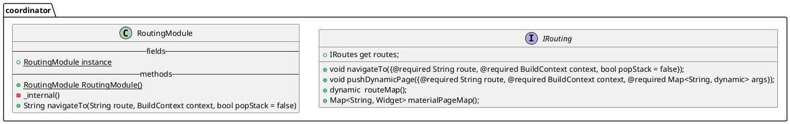

```plantuml
@startuml RoutingModule

package coordinator {

    interface IRouting {
         + void navigateTo({@required String route, @required BuildContext context, bool popStack = false});
         + void pushDynamicPage({@required String route, @required BuildContext context, @required Map<String, dynamic> args});
         + dynamic  routeMap();
         + Map<String, Widget> materialPageMap();
         + IRoutes get routes;
    }
    
    class RoutingModule {
        --fields--
        {static} + RoutingModule instance
        --methods--
        {static} + RoutingModule RoutingModule()
        - _internal()
        + String navigateTo(String route, BuildContext context, bool popStack = false)
    }
}

@enduml
```
