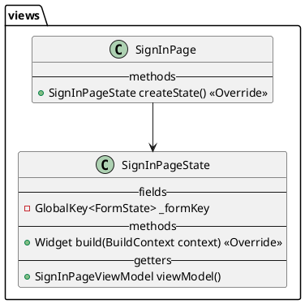

```plantuml
@startuml SignInPage

package views {
    class   SignInPage {
        -- methods --
        + SignInPageState createState() <<Override>>
    }
    class   SignInPageState {
        -- fields --
        - GlobalKey<FormState> _formKey
        -- methods --
        + Widget build(BuildContext context) <<Override>>
        -- getters --
        + SignInPageViewModel viewModel()
    }
}

SignInPage --> SignInPageState

@enduml
```