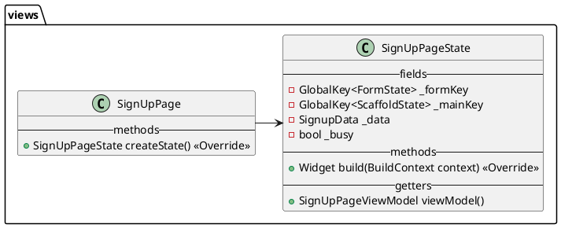

```plantuml
@startuml SignUpPage

package views {
    class   SignUpPage {
        -- methods --
        + SignUpPageState createState() <<Override>>
    }
    class   SignUpPageState {
        -- fields --
        - GlobalKey<FormState> _formKey
        - GlobalKey<ScaffoldState> _mainKey
        - SignupData _data
        - bool _busy
        -- methods --
        + Widget build(BuildContext context) <<Override>>
        -- getters --
        + SignUpPageViewModel viewModel()
    }
}

SignUpPage -> SignUpPageState

@enduml
```