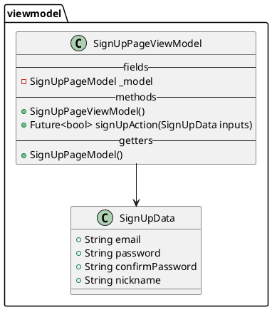

```plantuml
@startuml SignUpPageViewModel

package viewmodel {
    class   SignUpData {
        + String email
        + String password
        + String confirmPassword
        + String nickname
    }
    class   SignUpPageViewModel {
        -- fields --
        - SignUpPageModel _model
        -- methods --
        + SignUpPageViewModel()
        + Future<bool> signUpAction(SignUpData inputs)
        -- getters --
        + SignUpPageModel()
    }
}

SignUpPageViewModel --> SignUpData

@enduml
```